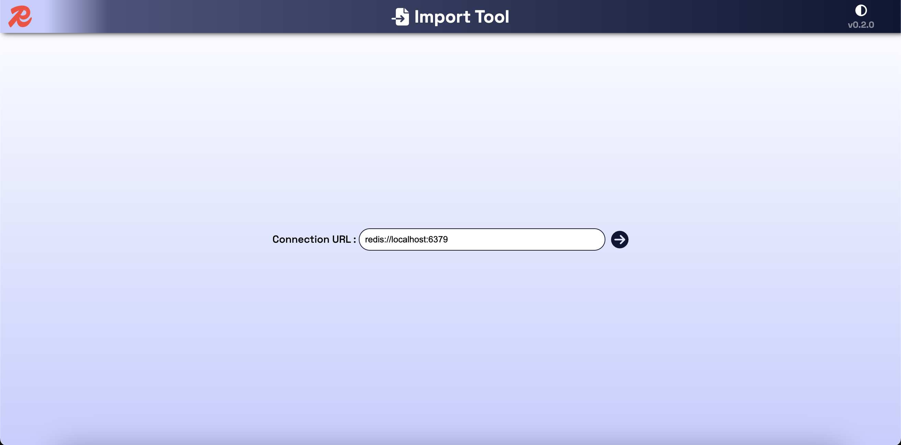
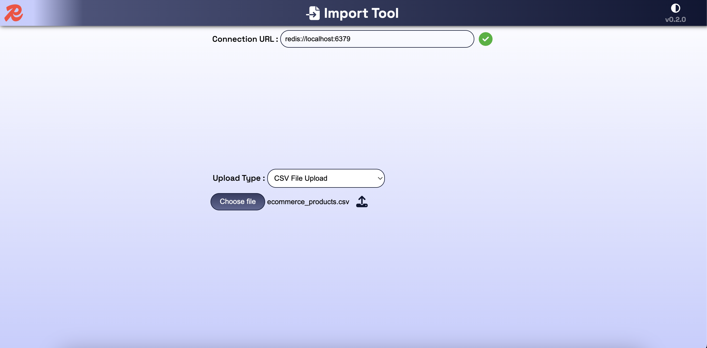
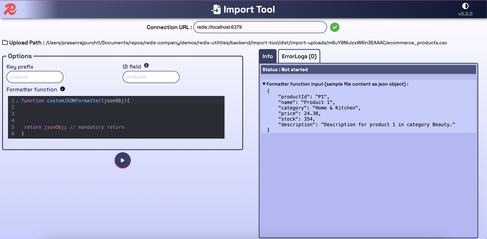
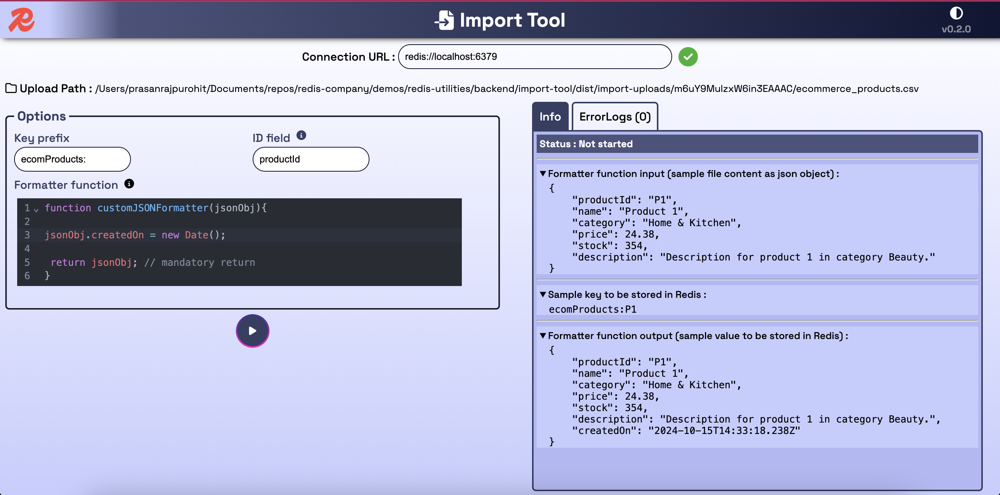
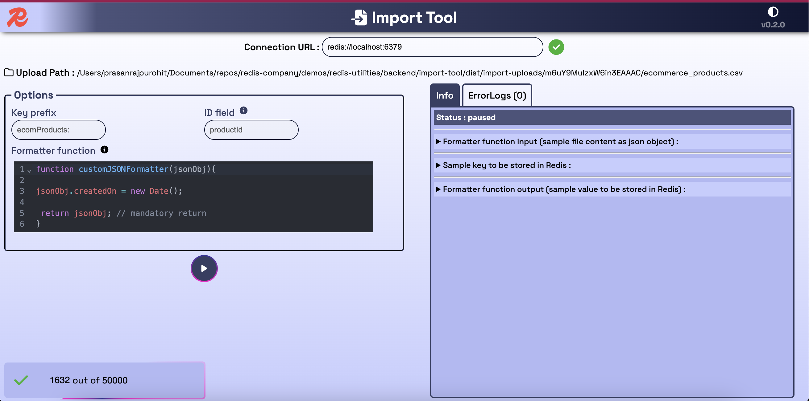
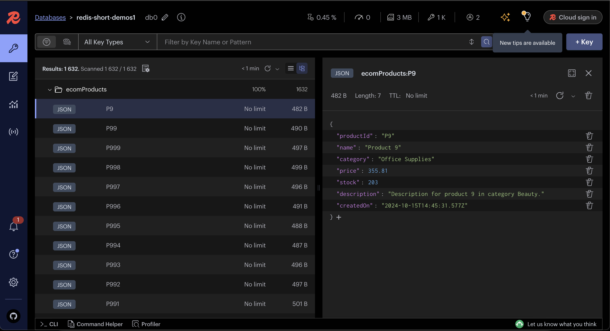

## Step 1

- Open your browser and navigate to `http://localhost:3000/import`. Enter the Redis connection URL and click the `Connect` icon button.

  

## Step 2

- Select the upload type:

  - `JSON array` file
  - `CSV` file
  - `Zipped JSON folder` containing multiple JSON files (each file representing a record)

  

- Choose the file and click the `Upload` icon.

## Step 3

- Import screen: This screen displays import options, import status, and error logs.

  

- Enter the import options:

  - `Key prefix`: A prefix that will be added to the Redis key.
  - `ID field`: The field from the JSON file or formatted output that will be used as the key in Redis. Nested fields (or JSON paths) are also supported, e.g., `meta.details.productId`.
  - `Formatter function`: A JavaScript function that formats the JSON data before adding it to Redis.

  ```js
  // Example Formatter function 1
  function customJSONFormatter(jsonObj) {
    jsonObj.insertedAt = new Date(); // Add a new field
    jsonObj.productDetails.brandName =
      jsonObj.productDetails.brandName.toUpperCase(); // Update a field
    delete jsonObj.meta; // Delete a field

    return jsonObj; // Mandatory return
  }
  ```

  ```js
  // Example Formatter function 2
  function customJSONFormatter(jsonObj) {
  return {
    productId: jsonObj.productDetails.id,
    productName: jsonObj.productDetails.productDisplayName,
    price: jsonObj.productDetails.price,
    insertedAt: new Date(),
  };
  ```

  

- As you change the import options, you can preview:
  - The Sample key that will be stored in Redis (based on the Key prefix and ID field).
  - The Formatter function output (based on the Formatter function code).

## Step 4

Click the Import (play) icon to start the import process.

- The information tab displays the import status, and any errors will appear in the errors tab.
- The number of processed records is shown in the status bar.
- You can pause and resume the import process at any time.



## Step 5

View the inserted records using [RedisInsight](https://redis.io/insight/)


